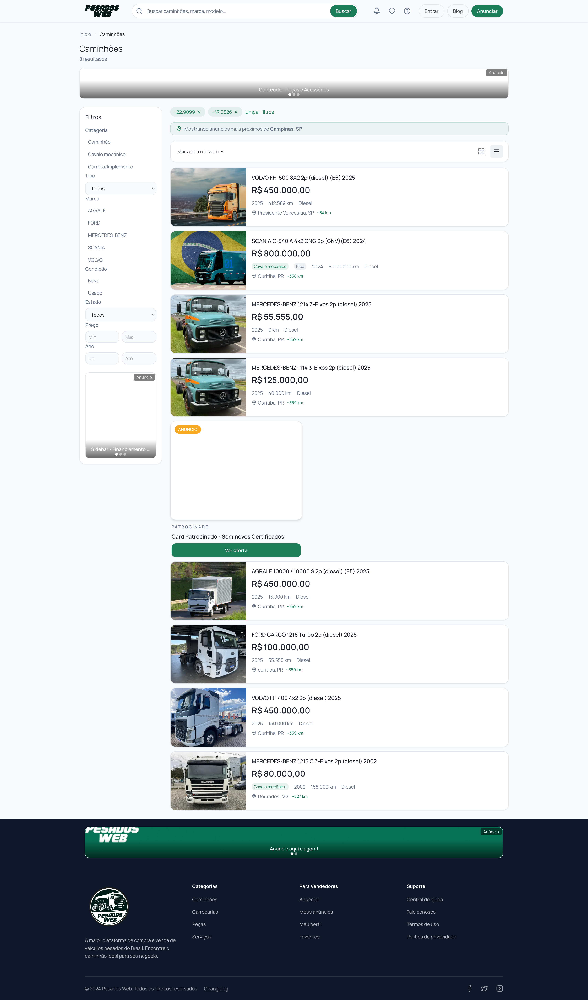
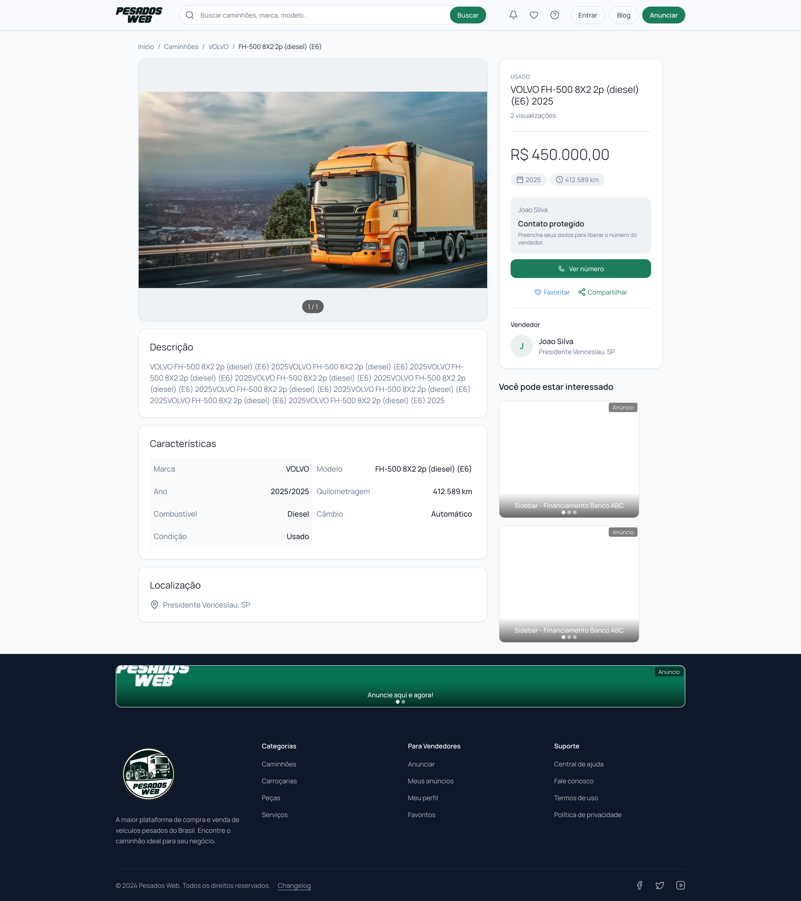
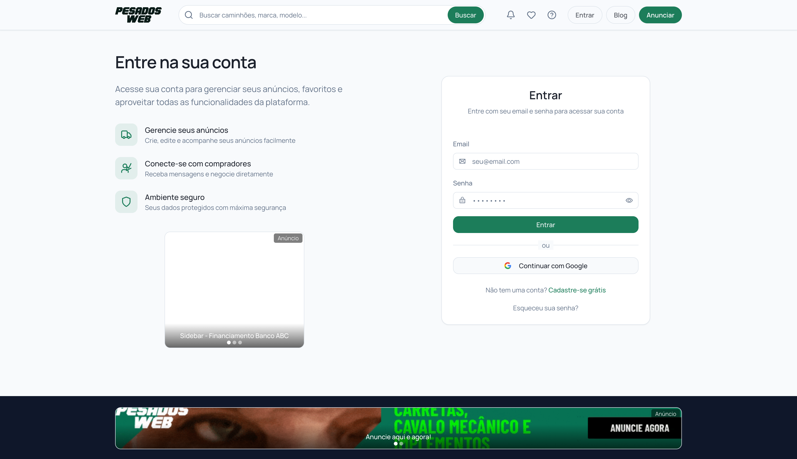
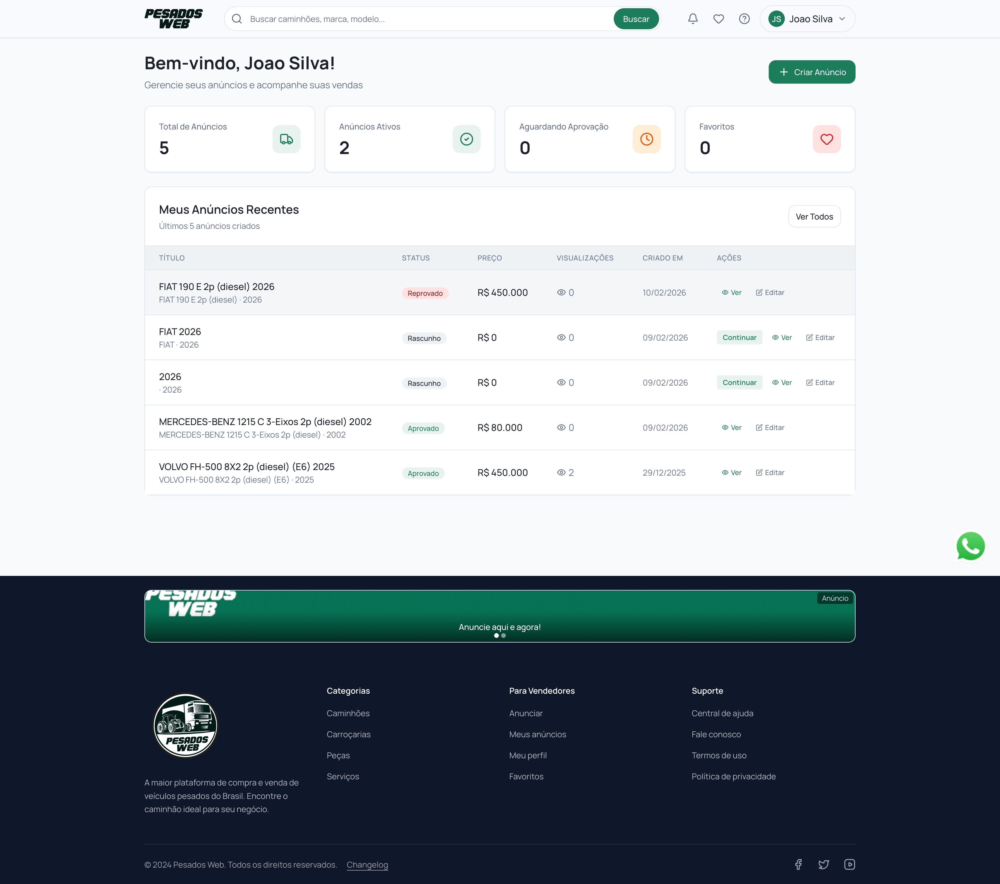
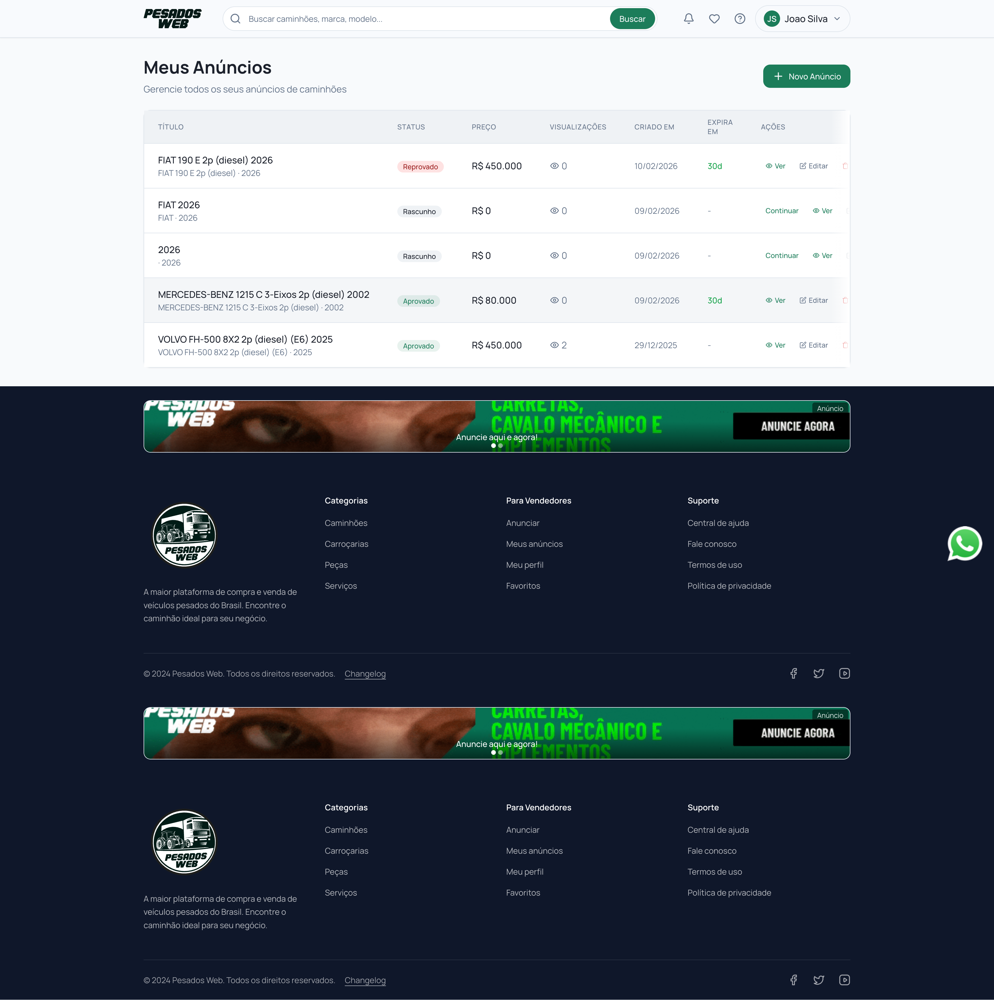
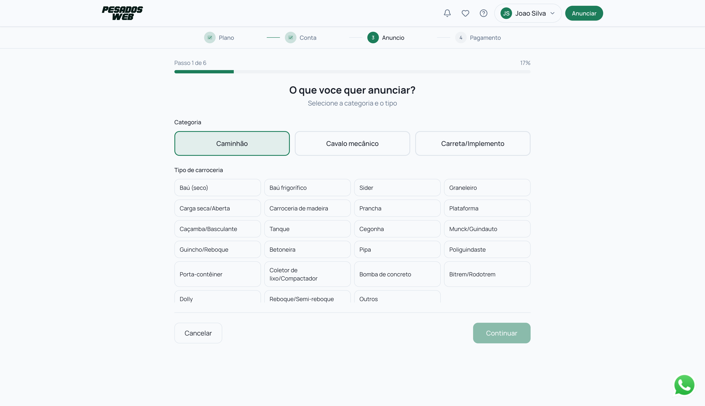
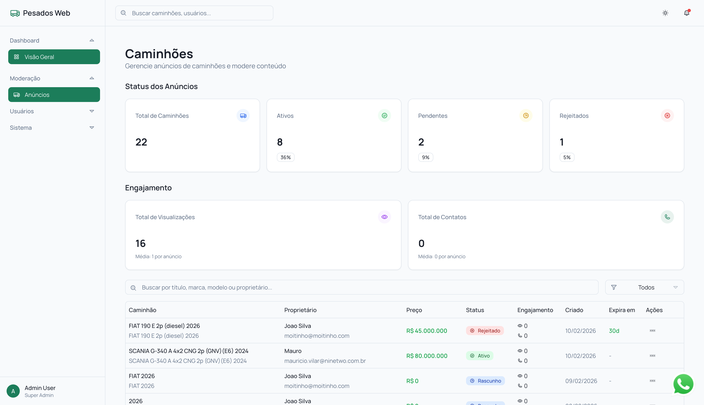
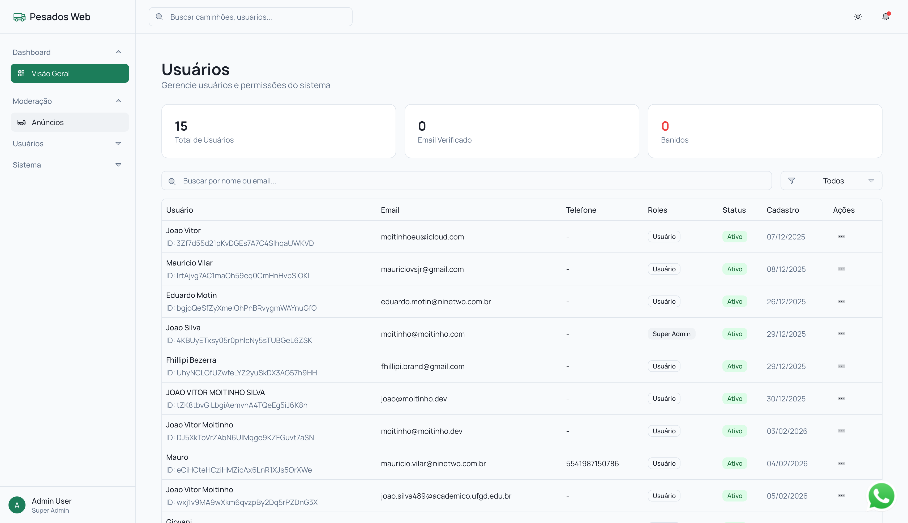

# Pesados Web

**Plataforma brasileira de classificados para veículos pesados e equipamentos.**

Marketplace completo que conecta compradores e vendedores de caminhões, cavalos mecânicos, carretas e implementos em todo o Brasil.

> **Site em produção:** [pesadosweb.com.br](https://pesadosweb.com.br)

---

## Sobre o Projeto

A Pesados Web foi desenvolvida do zero como uma plataforma SaaS de classificados voltada ao mercado de veículos pesados. O sistema conta com fluxo completo de publicação de anúncios, moderação administrativa, sistema de pagamentos integrado, marketing interno com créditos e geolocalização inteligente.

### Desenvolvedor

**João Vitor Moitinho Silva** — Arquitetura, desenvolvimento full-stack e deploy.

---

## Stack Tecnológica

| Camada | Tecnologia |
|---|---|
| Frontend | Next.js 14 (App Router), React, Tailwind CSS, shadcn/ui |
| Backend | Next.js API Routes, Server Actions |
| Banco de Dados | PostgreSQL + Drizzle ORM |
| Autenticação | Better Auth (email/senha + Google OAuth) |
| Pagamentos | Asaas API (PIX, boleto, cartão) |
| CMS | Sanity (produtos de marketing) |
| Storage | AWS S3 + CloudFront CDN |
| Deploy | Vercel |
| Monitoramento | RD Station, Google Analytics |

---

## Funcionalidades

### Plataforma Pública
- Catálogo com filtros avançados (marca, categoria, tipo de carroceria, ano, preço, estado)
- Geolocalização automática — ordena anúncios por proximidade do comprador
- Detalhes completos do veículo com galeria de fotos e vídeo
- Contato protegido (WhatsApp e telefone liberados mediante cadastro)
- Sistema de favoritos
- Blog integrado
- FAQ e Central de Ajuda

### Área do Vendedor (Dashboard)
- Fluxo de criação de anúncio em steps (plano, conta, categoria, veículo, fotos, pagamento)
- 3 categorias: Caminhão, Cavalo Mecânico, Carreta/Implemento
- 23 tipos de carroceria
- Upload de até 25 fotos + 1 vídeo por anúncio
- Gerenciamento de anúncios (status, visualizações, edição)
- Checkout integrado com Asaas (PIX com QR code)
- Notificações em tempo real

### Painel Administrativo
- Dashboard com métricas (anúncios, usuários, crescimento mensal)
- Moderação de anúncios (aprovar, rejeitar com motivo)
- Gestão de usuários (roles, ban, verificação)
- Logs de auditoria
- Configurações do sistema

### Sistema de Marketing
- Painel de marketing com créditos
- Anúncios patrocinados em posições estratégicas (header, sidebar, catálogo, detalhes)
- Métricas de impressões e cliques por campanha
- Banners gerenciados via Sanity CMS

---

## Screenshots

### Home Page

### Catálogo de Veículos

### Detalhes do Veículo

### Login

### Dashboard do Vendedor

### Meus Anúncios

### Fluxo de Anúncio - Escolha do Plano

### Fluxo de Anúncio - Categoria

### Fluxo de Anúncio - Tipo de Carroceria

### Admin - Dashboard

### Admin - Moderação de Anúncios

### Admin - Gestão de Usuários

### Painel de Marketing

---

## Licença

Este software é propriedade intelectual de **João Vitor Moitinho Silva** (CNPJ: 55.942.611/0001-40).

**Todos os direitos reservados.** Nenhuma parte deste software pode ser copiada, modificada, distribuída ou utilizada sem autorização expressa e por escrito do autor.

Consulte o arquivo [LICENSE](LICENSE) para detalhes completos.
